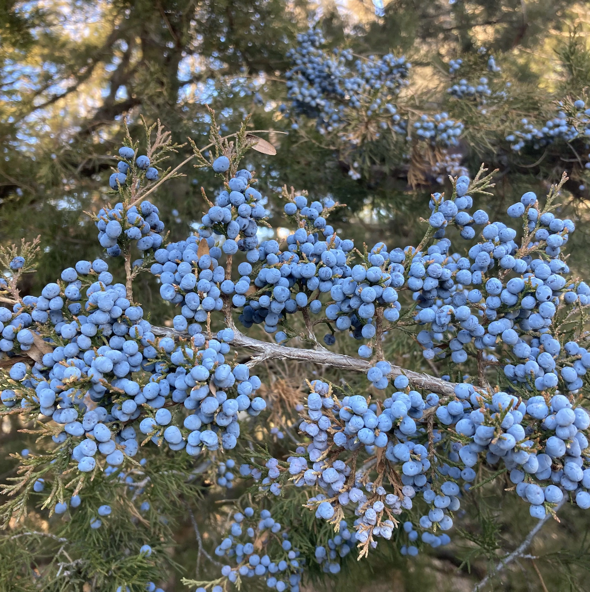

### Hi, my name is Sarah 👋

_I am an Associate Professor of Data Analytics at_ Denison University. _I conduct collaborative research in the areas of biodiversity change, animal movement, and the integration of data science skills into disciplinary domains. At Denison, I teach interdisciplinary undergrduate courses, including programming in R, python, and SQL, version control using GitHub, research methods, and project management._

**Here's a quick summary about me**
- 😄 Pronouns: she/her
- 🔭 I’m currently working on several National Science Foundation grants:
  - examining bird migration and range expansion of the eastern redcedar tree
  - species persistence in systems with long-term disturbance dynamics
  - integrating data science skills into undergraduate biology curricula
- 🌱 I’m currently (re)learning python after a long hiatus to focus on research projects that use R
- 📫 You can view my website at [https://sarahsupp.org](https://sarahsupp.org) and contact me through my [Denison University webpage](https://denison.edu/people/sarah-supp)

> 🚨 The languages shown above do not show my actual skillset but show the languages that are shown the most in my github

You can find me on LinkedIn:

 

  
<!--
**sarahsupp/sarahsupp** is a ✨ _special_ ✨ repository because its `README.md` (this file) appears on your GitHub profile.

Here are some ideas to get you started:

- 🌱 I’m currently learning ...
- 👯 I’m looking to collaborate on ...
- 🤔 I’m looking for help with ...
- 💬 Ask me about ...
- 📫 How to reach me: ...

- ⚡ Fun fact: ...
-->
